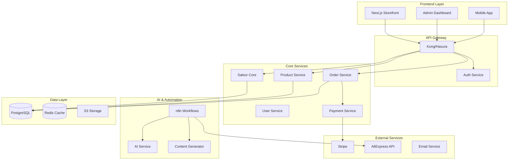

# 🏗 Edestory Platform Architecture

## 📋 Overview
Edestory - это масштабируемая B2B платформа для автоматизированного управления интернет-магазинами с фокусом на dropshipping из Азии в Европу.

## 🎯 Архитектурные принципы

1. **Scalability First** - Готовность к 2000+ магазинам
2. **Automation Everything** - Минимум ручной работы
3. **AI-Driven** - AI для контента и оптимизации
4. **Multi-tenant** - Изоляция данных клиентов
5. **Event-Driven** - Асинхронная обработка
6. **API-First** - GraphQL/REST APIs
7. **Cloud-Native** - Контейнеры и микросервисы

## 🏛 High-Level Architecture



## 📦 Технологический стек

### Frontend
| Технология | Версия | Назначение |
|-----------|---------|-----------|
| Next.js | 14/15 | SSR/SSG Framework |
| React | 18/19 | UI Library |
| TypeScript | 5.3 | Type Safety |
| Tailwind CSS | 3.4 | Styling |
| Playwright | Latest | E2E Testing |
| SWR | 2.0 | Data Fetching |

### Backend
| Технология | Версия | Назначение |
|-----------|---------|-----------|
| Saleor | 3.19 | E-commerce Core |
| FastAPI | 0.100 | Microservices |
| GraphQL | 16 | API Layer |
| PostgreSQL | 15 | Database |
| Redis | 7 | Cache/Queue |
| Celery | 5.3 | Task Queue |

### Infrastructure
| Технология | Версия | Назначение |
|-----------|---------|-----------|
| Docker | 24 | Containerization |
| Kubernetes | 1.28 | Orchestration |
| Terraform | 1.6 | IaC |
| GitHub Actions | - | CI/CD |
| Vercel | - | Frontend Hosting |
| AWS/GCP | - | Cloud Provider |

### AI & Automation
| Технология | Версия | Назначение |
|-----------|---------|-----------|
| n8n | 1.20 | Workflow Automation |
| Claude API | 3.5 | Content Generation |
| DALL-E | 3 | Image Generation |
| OpenAI | GPT-4 | Backup AI |

## 🔄 Data Flow

### 1. Product Import Flow
```
AliExpress API → n8n Workflow → Product Service → PostgreSQL → Cache → Storefront
```

### 2. Order Processing Flow
```
Customer Order → Storefront → Order Service → Payment Service → Stripe
                                      ↓
                              AliExpress Order → Fulfillment
```

### 3. Content Generation Flow
```
Schedule Trigger → n8n → Claude API → Content Service → CMS → Storefront
                     ↓
                 DALL-E → Image Service → S3 → CDN
```

## 🏪 Multi-tenancy Strategy

### Уровни изоляции
1. **Database Level** - Отдельные схемы для каждого клиента
2. **Application Level** - Tenant ID в каждом запросе
3. **Infrastructure Level** - Отдельные контейнеры для крупных клиентов

### Tenant Structure
```javascript
{
  tenantId: "uuid",
  domain: "store.example.com",
  config: {
    theme: "edestory",
    language: ["es", "en"],
    currency: "EUR",
    timezone: "Europe/Madrid"
  },
  limits: {
    products: 10000,
    orders: 1000/day,
    storage: "100GB"
  }
}
```

## 🔐 Security Architecture

### Layers of Security
1. **Network** - CloudFlare DDoS Protection
2. **Application** - OWASP Top 10 compliance
3. **Data** - Encryption at rest and in transit
4. **Access** - RBAC with JWT tokens
5. **Compliance** - GDPR, PCI DSS

### Authentication Flow
```
User Login → Auth Service → JWT Token → API Gateway → Service
                  ↓
              Refresh Token → Redis Cache
```

## 📊 Database Schema (Core Tables)

### Stores
```sql
CREATE TABLE stores (
    id UUID PRIMARY KEY,
    tenant_id UUID NOT NULL,
    name VARCHAR(255),
    domain VARCHAR(255) UNIQUE,
    created_at TIMESTAMP,
    status ENUM('active', 'suspended', 'trial')
);
```

### Products
```sql
CREATE TABLE products (
    id UUID PRIMARY KEY,
    store_id UUID REFERENCES stores(id),
    sku VARCHAR(100),
    name VARCHAR(255),
    price DECIMAL(10,2),
    aliexpress_id VARCHAR(100),
    sync_status ENUM('synced', 'pending', 'error')
);
```

### Orders
```sql
CREATE TABLE orders (
    id UUID PRIMARY KEY,
    store_id UUID REFERENCES stores(id),
    customer_id UUID,
    total DECIMAL(10,2),
    status ENUM('pending', 'processing', 'shipped', 'delivered'),
    aliexpress_order_id VARCHAR(100)
);
```

## 🚀 Deployment Architecture

### Environments
```yaml
Development:
  - Local Docker Compose
  - Hot reload enabled
  - Debug mode on

Staging:
  - Kubernetes cluster
  - Replica of production
  - Test data

Production:
  - Multi-region deployment
  - Auto-scaling enabled
  - CDN distribution
  - Database replication
```

### CI/CD Pipeline
```yaml
1. Code Push → GitHub
2. GitHub Actions triggered
3. Run tests (unit, integration, e2e)
4. Build Docker images
5. Push to registry
6. Deploy to staging
7. Run smoke tests
8. Manual approval
9. Deploy to production
10. Monitor metrics
```

## 📈 Scaling Strategy

### Horizontal Scaling
- **Stateless Services** - Easy to scale
- **Database** - Read replicas + sharding
- **Cache** - Redis Cluster
- **Files** - S3 with CloudFront CDN

### Vertical Scaling Thresholds
```yaml
0-10 stores: Single server (2 vCPU, 4GB RAM)
10-100 stores: Kubernetes cluster (10 vCPU, 32GB RAM)
100-500 stores: Multi-region (50 vCPU, 128GB RAM)
500+ stores: Custom infrastructure
```

## 🔄 Event-Driven Architecture

### Key Events
```javascript
// Product Events
product.created
product.updated
product.synced
product.out_of_stock

// Order Events
order.placed
order.paid
order.shipped
order.delivered

// Store Events
store.created
store.activated
store.suspended
```

### Event Processing
```
Event → Message Queue (RabbitMQ/Kafka) → Consumer Services → Side Effects
```

## 📊 Monitoring & Observability

### Metrics Stack
- **Prometheus** - Metrics collection
- **Grafana** - Visualization
- **Sentry** - Error tracking
- **ELK Stack** - Log aggregation
- **Jaeger** - Distributed tracing

### Key Metrics to Track
```yaml
Business:
  - Revenue per store
  - Order success rate
  - Product sync status
  - Customer satisfaction

Technical:
  - API response time
  - Error rate
  - Database query time
  - Cache hit rate
  - CPU/Memory usage
```

## 🔄 Backup & Disaster Recovery

### Backup Strategy
```yaml
Database:
  - Daily full backup
  - Hourly incremental
  - 30-day retention
  - Cross-region replication

Files:
  - S3 versioning enabled
  - Lifecycle policies
  - Glacier for archives

Code:
  - Git repository
  - Tagged releases
  - Rollback capability
```

### RTO/RPO Targets
- **RTO** (Recovery Time Objective): < 1 hour
- **RPO** (Recovery Point Objective): < 15 minutes

## 🎯 Performance Targets

### Frontend
- First Contentful Paint: < 1.5s
- Time to Interactive: < 3.5s
- Lighthouse Score: > 90

### Backend
- API Response: < 200ms (p95)
- Database Query: < 50ms (p95)
- Background Jobs: < 5min completion

### Infrastructure
- Uptime: 99.95%
- Auto-scaling trigger: 70% CPU
- Cost per store: < €5/month

## 🔮 Future Architecture Evolution

### Phase 1: Current (MVP)
- Monolithic Saleor core
- Single database
- Basic automation

### Phase 2: Growth (100 stores)
- Service decomposition
- Read/write splitting
- Advanced caching

### Phase 3: Scale (500 stores)
- Full microservices
- Event sourcing
- CQRS pattern

### Phase 4: Enterprise (2000+ stores)
- Multi-region active-active
- Custom hardware
- ML optimization

## 📚 Architecture Decision Records (ADRs)

### ADR-001: Use Saleor as e-commerce core
**Status**: Accepted
**Context**: Need robust e-commerce functionality
**Decision**: Use Saleor instead of building from scratch
**Consequences**: Faster development, proven solution

### ADR-002: Next.js for frontend
**Status**: Accepted
**Context**: Need SEO and performance
**Decision**: Next.js with SSR/SSG
**Consequences**: Better SEO, faster initial load

### ADR-003: n8n for automation
**Status**: Accepted
**Context**: Need visual workflow automation
**Decision**: n8n over custom solution
**Consequences**: Faster automation setup, visual debugging

---

*Version: 1.0*
*Last Updated: December 2025*
*Next Review: Q1 2026*