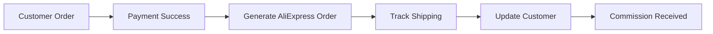

# AliExpress Affiliate API Setup

## 📌 Что можно без юрлица
✅ **Affiliate программа** - доступна физическим лицам
✅ **Комиссия 3-8%** от продаж
✅ **API доступ** после регистрации
✅ **Отслеживание заказов** через API

## 1. Регистрация в AliExpress Affiliate

1. Перейдите на https://portals.aliexpress.com
2. Зарегистрируйтесь как **Individual** (физлицо)
3. Заполните профиль:
   - Website URL: shop.ede-story.com
   - Traffic Source: SEO, Social Media
   - Category: Fashion, Electronics

## 2. Получение API ключей

После одобрения (1-3 дня):
1. Dashboard → App Management
2. Create New App
3. Получите:
   - App Key
   - App Secret
   - Tracking ID

## 3. API Endpoints

### Поиск товаров
```javascript
const searchProducts = async (keywords) => {
  const params = {
    app_key: process.env.ALIEXPRESS_APP_KEY,
    keywords: keywords,
    target_currency: 'EUR',
    target_language: 'ES',
    ship_to_country: 'ES',
    sort: 'SALE_PRICE_ASC',
    page_size: 50
  };
  
  const response = await fetch('https://api-sg.aliexpress.com/sync', {
    method: 'POST',
    body: JSON.stringify({
      method: 'aliexpress.affiliate.product.query',
      ...params
    })
  });
  
  return response.json();
};
```

### Генерация партнерской ссылки
```javascript
const generateAffiliateLink = async (productUrl) => {
  const params = {
    app_key: process.env.ALIEXPRESS_APP_KEY,
    promotion_link_type: 2,
    source_values: productUrl,
    tracking_id: process.env.ALIEXPRESS_TRACKING_ID
  };
  
  const response = await fetch('https://api-sg.aliexpress.com/sync', {
    method: 'POST', 
    body: JSON.stringify({
      method: 'aliexpress.affiliate.link.generate',
      ...params
    })
  });
  
  return response.json();
};
```

## 4. Интеграция с Saleor

### Product Import Service
```typescript
// src/services/aliexpress-import.ts
import { AliexpressAPI } from './aliexpress-api';
import { SaleorClient } from './saleor-client';

export class ProductImportService {
  async importProducts(category: string) {
    // 1. Получаем товары из AliExpress
    const products = await AliexpressAPI.searchProducts({
      category,
      ship_to: 'ES',
      min_sale_price: 10,
      max_sale_price: 500
    });
    
    // 2. Фильтруем по критериям
    const filtered = products.filter(p => 
      p.evaluation_rate > 4.5 &&
      p.thirty_days_commission_rate > 5
    );
    
    // 3. Импортируем в Saleor
    for (const product of filtered) {
      await SaleorClient.createProduct({
        name: product.product_title,
        description: product.product_detail_url,
        price: product.target_sale_price * 1.3, // 30% наценка
        images: product.product_main_image_url,
        affiliate_url: await this.generateAffiliateLink(product.product_detail_url)
      });
    }
  }
}
```

## 5. n8n Workflow для автоматизации

### Автоимпорт товаров (каждые 4 часа)
```json
{
  "name": "AliExpress Product Sync",
  "nodes": [
    {
      "name": "Schedule",
      "type": "n8n-nodes-base.scheduleTrigger",
      "parameters": {
        "rule": {
          "interval": [{ "field": "hours", "hoursInterval": 4 }]
        }
      }
    },
    {
      "name": "Get Hot Products",
      "type": "n8n-nodes-base.httpRequest",
      "parameters": {
        "url": "https://api-sg.aliexpress.com/sync",
        "method": "POST",
        "body": {
          "method": "aliexpress.affiliate.hotproduct.query",
          "app_key": "={{$env.ALIEXPRESS_APP_KEY}}",
          "platform_product_type": "ALL",
          "target_currency": "EUR"
        }
      }
    },
    {
      "name": "Filter Products",
      "type": "n8n-nodes-base.if",
      "parameters": {
        "conditions": {
          "number": [
            {
              "value1": "={{$json.sale_price}}",
              "operation": "largerEqualNumber",
              "value2": 10
            },
            {
              "value1": "={{$json.commission_rate}}",
              "operation": "largerEqualNumber", 
              "value2": 5
            }
          ]
        }
      }
    },
    {
      "name": "Import to Saleor",
      "type": "n8n-nodes-base.graphql",
      "parameters": {
        "endpoint": "http://localhost:8000/graphql/",
        "query": "mutation CreateProduct($input: ProductInput!) {\n  productCreate(input: $input) {\n    product { id }\n  }\n}"
      }
    }
  ]
}
```

## 6. Обработка заказов

### Order Fulfillment Flow


### Tracking Service
```javascript
const trackOrder = async (orderId) => {
  const params = {
    app_key: process.env.ALIEXPRESS_APP_KEY,
    order_ids: orderId
  };
  
  const response = await fetch('https://api-sg.aliexpress.com/sync', {
    method: 'POST',
    body: JSON.stringify({
      method: 'aliexpress.affiliate.order.get',
      ...params
    })
  });
  
  return response.json();
};
```

## 7. Комиссионная структура

```yaml
Наша наценка: 30-50%
AliExpress комиссия: 3-8%
Итоговая маржа: 33-58%

Пример:
- Товар на AliExpress: €20
- Наша цена: €30 (50% наценка)
- Комиссия AliExpress: €0.60-1.60 (3-8%)
- Чистая прибыль: €10.60-11.60
```

## 8. Автоматизация контента через AI

```javascript
// Генерация описаний через Claude API
const generateDescription = async (product) => {
  const prompt = `
    Создай привлекательное описание товара для испанского рынка:
    Название: ${product.title}
    Категория: ${product.category}
    Цена: €${product.price}
    Особенности: ${product.features}
    
    Требования:
    - На испанском языке
    - SEO оптимизировано
    - Подчеркни качество и быструю доставку
    - 150-200 слов
  `;
  
  const response = await claude.complete(prompt);
  return response.text;
};
```

## 9. Что НЕ требует юрлица

✅ Регистрация в Affiliate программе
✅ Получение API ключей
✅ Импорт товаров
✅ Генерация партнерских ссылок
✅ Получение комиссий на PayPal/Payoneer
✅ Отслеживание заказов

## 10. Ограничения без юрлица

❌ Прямой dropshipping (нужен бизнес аккаунт)
❌ Bulk закупки
❌ Кастомная упаковка
❌ Приоритетная поддержка

---

**Статус:** Готово к внедрению
**Следующий шаг:** Регистрация на portals.aliexpress.com
**Время на одобрение:** 1-3 дня